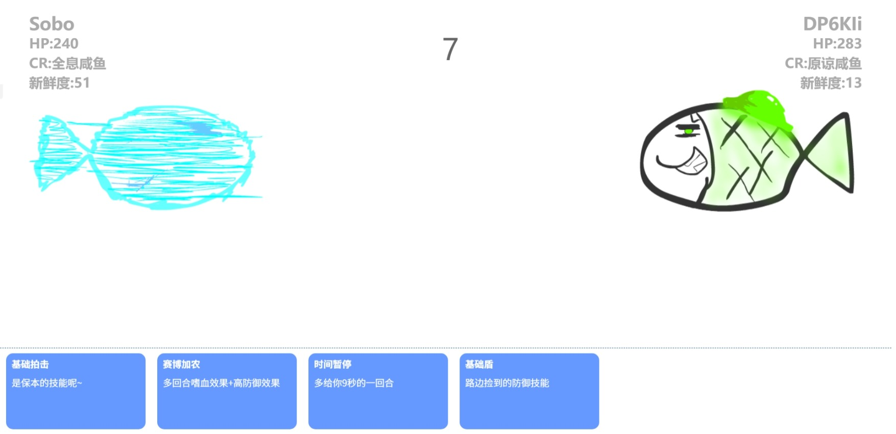

# SaltedFish

[](https://www.bilibili.com/video/BV15s411E7jf/)  
> 点击图片可以观看演示视频  

18 年 6 月那会儿摸索轮询请求、WebSocket 时做的一个联机双🐟对战小游戏，代码很糟糕，但是能跑.jpg  

## 碎碎念

最开始时这个游戏是纯用轮询请求实现的，每个玩家端在游玩期间会给服务端发送大量请求来获取状态信息，但是你还别说，联机效果还真能实现 😂...后来发觉这样不太行，就学了一下 Workerman 框架，换上 WebSocket 长连接了，也就是现在这个仓库中的版本。    

另外就是当时高中的时候和隔壁班用这个游戏对战过，看到大家玩自己的游戏玩的这么开心，真的是很美好的回忆了！  

不过现在看来不仅代码写得像一坨💩，好像没考虑什么并发问题，部署的时候真的也还挺麻烦的，正好最近想起来这玩意了，干脆打包成~~精致的~~ Docker 镜像吧~    

* ⚠ 注：**可能有本地文件包含漏洞（LFI）等漏洞**，因此如果要在生产环境部署的话， `backend` 部分一定要在 Docker 容器内运行，**不要挂载宿主机的敏感目录，更不要直接在宿主机上跑**。    

大概也不会再更新了，当作一个纪念项目吧，致当年开心摆弄 PHP 的那段时光。  

## 部署

### 后端部分

* 相应源码位于本仓库的 `./backend` 目录下  
* 实际上后端部分也是有可以配置的地方的 (`./backend/config`)，不过为了简略起见这里就不写了  

直接拉取 Docker 容器即可快速进行部署:  

```bash
docker pull somebottle/saltedfish-backend:1.6.1
```
> 容器镜像采用最小化构建，程序执行用户为**非 root 用户**，可放心使用。  

容器内会监听两个端口:  

| 端口 | 说明 |
| ---- | ---- |
| `8080` | HTTP 服务端口，游戏的 API 接口 |
| `9527` | WebSocket 服务端口，游戏的实时通信接口 |

启动容器时可以指定端口映射:  

```bash
docker run -d --name fish --restart unless-stopped -p 9680:8080 -p 9681:9527 somebottle/saltedfish-backend:1.6.1
```
> 这样一来就把容器内的 `8080` 和 `9527` 端口分别映射到宿主机的 `9680` 和 `9681` 端口了。  

### 前端部分

* 相应源码位于本仓库的 `./frontend` 目录下.

前端部分部署在静态托管服务上即可，如 Github Pages、Vercel、Netlify 等。  

为了连接到后端服务，你需要修改 `./frontend/jcs/config.js` 中的部分配置:  

```javascript
var servers = {
	server1: {
		name: '自由♂美利坚',
		ws: 'ws://127.0.0.1:9681', // 9681 是上面 Docker 容器映射的 WebSocket 端口
		core: 'http://127.0.0.1:9680/core/' // 9680 是上面 Docker 容器映射的 HTTP 服务端口, /core/ 是后端 API 的主路径
	},
    // 当然这里支持多个服务器配置
}
// 默认连接的服务器，不是当前用户选择的服务器
// 当当前用户选择的服务器无法连接时会自动切换为这个服务器
var defaultserver = 'server1';
```

这个配置文件中还有其他两项:  

```javascript
var musiclist = ['https://resources.xbottle.top/Radius.mp3']; // 游戏主界面的随机切歌列表
var soundResourceBase = './sound/'; // 为了加速音效资源的载入，你可以自行把 sound/ 目录下的音效文件上传到静态托管服务上，然后修改这个路径为对应的 URL 地址，末尾不要掉了 '/'
```

## 进阶配置

为了使用安全连接，你可以利用 Nginx 代理上面这两个接口。在 Nginx 启用 SSL 模块后，示例配置如下:  

```conf
location /fish_backend/ {
    proxy_pass http://127.0.0.1:9680/;
    proxy_set_header Host $host;
    proxy_set_header X-Real-IP $remote_addr;
    proxy_set_header X-Forwarded-For $proxy_add_x_forwarded_for;
    proxy_set_header X-Forwarded-Proto $scheme;
    rewrite ^/fish_backend/(.*)$ /$1 break;
}

location /fish_wss/ {
    proxy_pass http://127.0.0.1:9681;
    proxy_set_header X-Real-IP $remote_addr;
    proxy_set_header Host $host;
    proxy_set_header X-Forwarded-For $proxy_add_x_forwarded_for;
    proxy_http_version 1.1;
    proxy_set_header Upgrade $http_upgrade;
    proxy_set_header Connection "upgrade";
    rewrite /fish_wss/(.*) /$1 break;
    proxy_redirect off;
}
```

这样一来就可以这样配置前端的 `./frontend/jcs/config.js` 文件了:  

```javascript
var servers = {
	server1: {
		name: '自由♂美利坚',
		ws: 'wss://<backend_domain>/fish_wss/', 
		core: 'https://<backend_domain>/fish_backend/core/'
	},
}
```

## License

[Apache License 2.0](./LICENSE)

